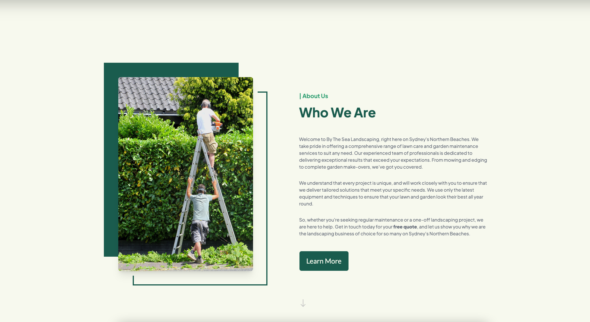
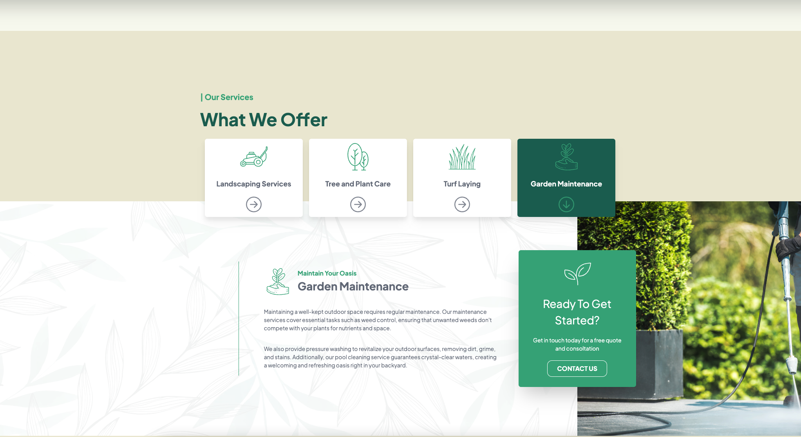
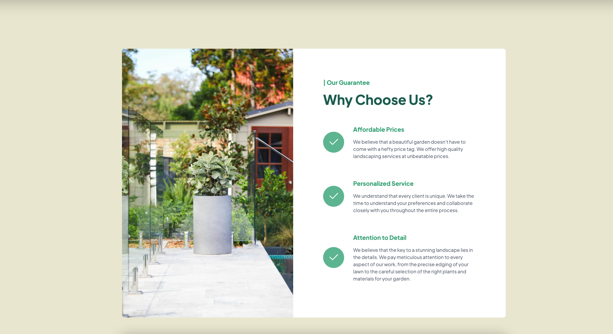
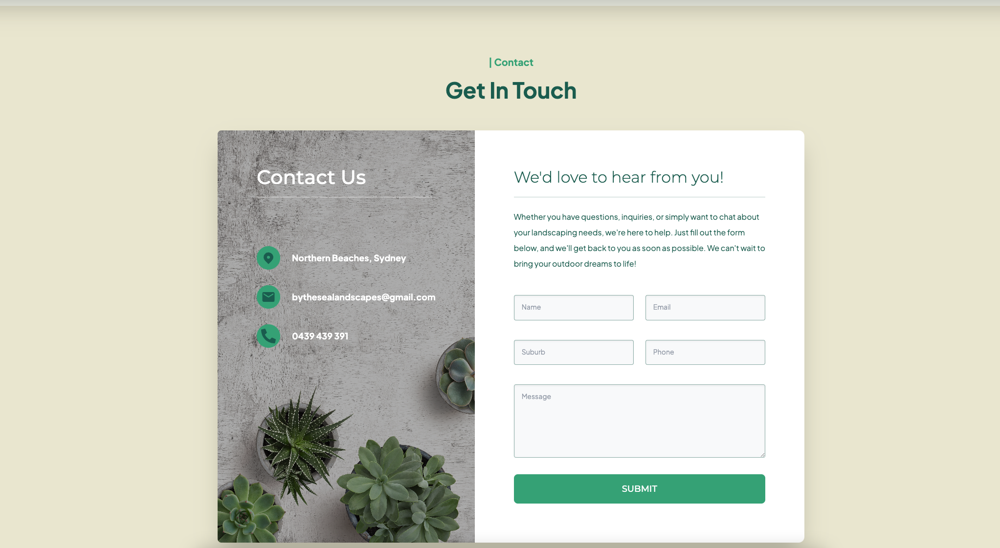
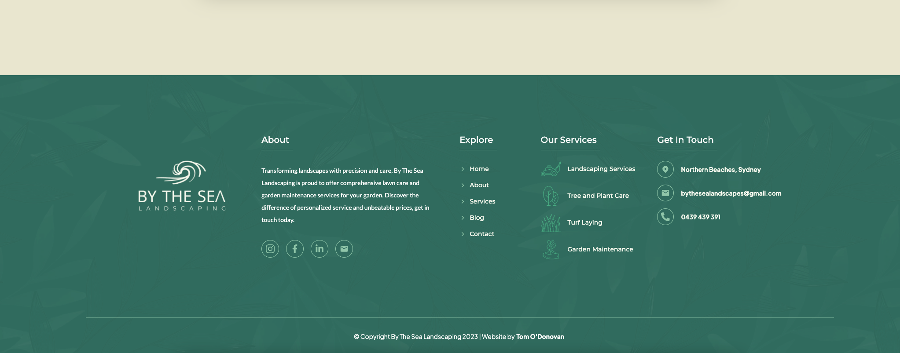

>Freelance Website Build
# By The Sea Landscaping

</br>
This repository contains the code for a small landscaping business website built using React, Next.js, Tailwind, and Framer Motion. The website aims to showcase the services offered by the landscaping business and provide information to potential clients.
</br>


<div align="center" width='100%' height='1000px' style="display: flex; flex-wrap: wrap; justify-content: center; overflow-y: scroll;">
    </br>
     
     
     
     
     
     
     
    </br>
</div>
</br>

## Project Guidelines

### Objective

The client's requirements were to create a modern and responsive website that effectively promotes their services and engages with potential customers. The website's design, features, and functionality were tailored to meet the client's specific business goals and branding.

### Design and Styling 

- The website should have a modern and clean design aesthetic.
- Utilize the provided brand guidelines and assets (logo, color palette, etc.).
- Ensure that the design is responsive and provides an optimal user experience across different devices (desktop, tablet, mobile).

### Functionality

- Implement the required sections requested by the client.
- Ensure that the website is fully functional and performs as expected.
- Implement a working contact form with proper validation and integration with the clients email address.

### Deployment

- The project should be deployed to a web hosting platform (e.g., Vercel, Netlify) for live testing and production use.
- Ensure that the website is deployed with proper domain and SSL configuration.
- Provide SEO and web analytics for the client.

## Features

- **Responsive Design:** The website is designed to provide an optimal viewing experience across various devices, including desktops, tablets, and mobile phones.

- **Modular Sections and Components:** The website is organized into several sections, including a hero section, about section, services section, projects section, and more. Each section is implemented as a reusable component to maintain code modularity.

- **Contact Form:** A contact form is provided to allow visitors to get in touch with the landscaping business directly. The form includes fields for name, email, subject, and message, enhancing communication with potential clients.

- **Email Integration:** The contact form integrates with [Nodemailer](https://nodemailer.com/about/) and sends an email to the business when a user submits the form. The email includes the submitted data, such as the name, email, location, phone, and message.

- **Form Validation:** The contact form employs [Yup](https://www.npmjs.com/package/yup) for form validation. It ensures that the required fields are filled out correctly, such as validating the email format and phone number format.

- **Animated Transitions:** The website utilizes [Framer Motion](https://www.framer.com/motion/), a popular animation library for React, to add smooth and engaging animations to various elements, enhancing the overall user experience.

- **Navigation and Footer:** The website includes a navigation bar for easy navigation between sections and a footer section containing relevant links and information.


## Technologies Used

### Front-End

- **React:** A JavaScript library for building user interfaces, used as the foundation of the website.

- **Next.js:** A React framework for server-rendered applications, providing improved performance, SEO capabilities, and easy routing.

- **Tailwind CSS:** A utility-first CSS framework used for styling the website. It provides a responsive and customizable design system.

- **Framer Motion:** A popular animation library for React, used to add smooth and engaging animations to various elements of the website.

- **Formik:** A form library for React that helps with form handling, validation, and error display.

- **Yup:** A JavaScript schema validation library used for defining and validating the shape of data.

### Back-End

- **Express:** A minimalist web application framework for Node.js used to handle the API route for the contact form submission.

- **Nodemailer:** A module for Node.js applications that allows sending emails using SMTP or sendmail transport.

### Deployment

**Vercel** was implemented for deployment and testing of the project due to its seamless integration with Next.js via the Vercel CLI. Some other key features include:

- **Continuous Deployment**: Allowing for updates to be deployed whenever changes are pushed to the main branch. This allowed the client to have ready access to the MVP throughout the testing stages of the project.
- **Environment Variables**: Vercel provided a secure way to manage environment variables. We leveraged this feature to store sensitive information, such as API keys email data, without exposing them in our codebase.
- **Scaling and Performance**: Vercel automatically handles scalability and performance optimizations for the application. With built-in caching, content delivery network (CDN) distribution, and serverless functions, ensuring fast and reliable delivery of the application to users.


## Feedback 

Feedback and suggestions for this project is welcome. If you find any issues or have suggestions for improvements, please open an issue or submit a pull request. Ensure that you follow the established coding guidelines and best practices.

## Acknowlegements 

- [By The Sea Landscaping](https://bythesealandscapes.com) 
- [React](https://reactjs.org/)
- [Next.js](https://nextjs.org/)
- [Tailwind CSS](https://tailwindcss.com/)
- [Framer Motion](https://www.framer.com/motion/)
- [Formik](https://formik.org/)
- [Yup](https://www.npmjs.com/package/yup)
- [Express](https://expressjs.com/)
- [Nodemailer](https://nodemailer.com/about/)
- [Vercel](https://vercel.com/)

## Getting Started

### Installation

1. Clone the repository:

    ```bash
    git clone https://github.com/tom-odonovan/By-The-Sea-Landscaping.git
    ```

2. Install the dependencies:

    ```bash
    cd By-The-Sea-Landscaping
    npm install
    # or
    yarn install
    ```

### Usage

1. Run the development server:

    ```bash
    npm run dev
    # or
    yarn dev
    ```

2. Open [http://localhost:3000](http://localhost:3000) with your browser to see the result.


## Licence 

This project is licensed under the [MIT License](https://opensource.org/license/mit/).